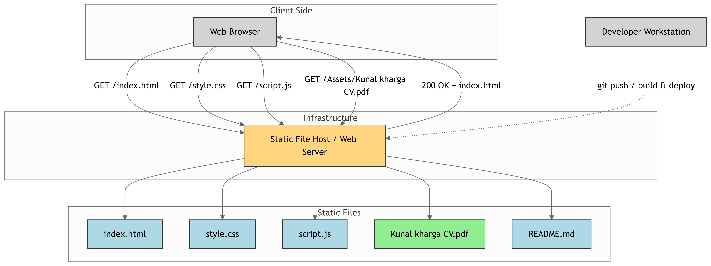

# 💼 Kunal Kharga — Personal Portfolio

Welcome to my **personal portfolio** repository. This project showcases who I am, what I do, the skills I have, and the work I’ve done as a web developer.

🔗 **Live Website**: [www.kunalkharga.com.np](https://www.kunalkharga.com.np/)

---

## 👨‍💻 About Me

Hi, I'm **Kunal Kharga**, a third-year **BCA student** from **New Summit College**, Kathmandu, Nepal — affiliated with **Tribhuvan University**. I’m a passionate **Full-Stack Web Developer** with a strong focus on frontend development. I love building clean, user-friendly websites that solve real problems.

---

## 🚀 Features

- Fully responsive design
- Smooth scroll and interactive UI
- Sections: Home, About, Skills, Portfolio, Contact
- Integrated contact form
- Clean and modern layout

---

## 🛠️ Technologies Used

### 🌐 Frontend
- **HTML5**
- **CSS3**
- **JavaScript**

### 🎨 Design
- Custom CSS Animations
- Responsive Layouts (Media Queries)

### 🔧 Tools
- **VS Code**
- **Git & GitHub**

---

## 📊 Deployment & File Flow Diagram

The following diagram illustrates how my portfolio website is structured and how files are served to the client from a static file host/web server.

---

## 📝 License

This project is open-source and free to use. Feel free to fork, modify, or contribute.
This project is licensed under the [MIT License](LICENSE).

---

⭐️ **Thank you for visiting my portfolio!** If you like this project, don’t forget to give it a star!
